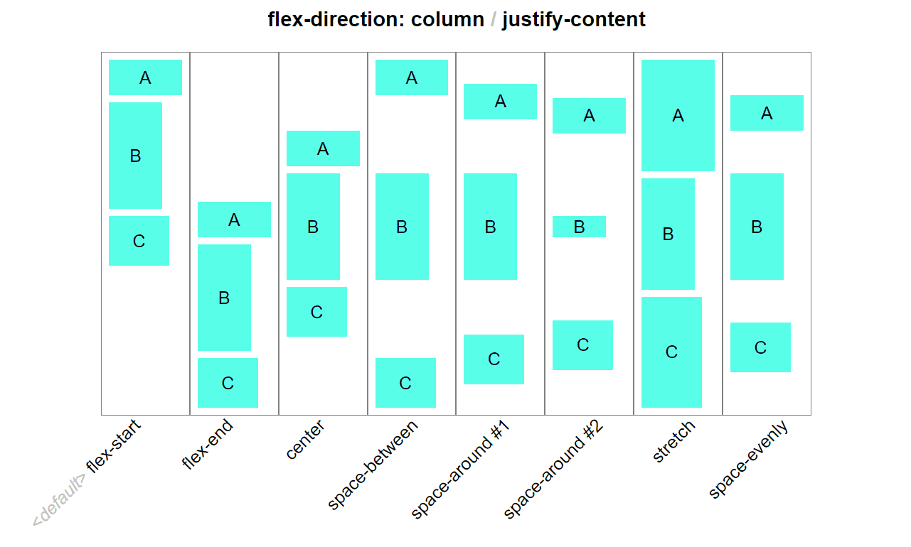

# Curso Definitivo de HTML y CSS

***
## Video 1 - ¿Qué aprenderás en este sobre HTML y CSS?

Los estándares de conocimiento para ser un desarrollador web
son tres:
1. HTML
1. CSS
1. JavaScript

En este curso solo veremos HTML y CSS

***
## Video 2 - ¿Qué es fronted?

Fronted:
* Desarrollador que maneja las cosas al **lado del cliente**(navegador).
* Tecnología Fronted:
    * HTML
    * CSS
    * JS
* Frameworks de CSS
    + Bootstrap
* Frameworks y librerias de JS
    + Angular
    * NodeJS
* Procesadores de CCS
    + {Less}
    + Styless
    + Sass
* Compilador/Empaquetador de JS
    + Babel
    + Webpack

***
## Video 3 - ¿Qué es Backend?

Backend:
* Es lo opuesto de Frontend.
* Hay más tecnologías y lenguajes de programación.
* Frameworks 
    + Django
    + Laravel
    + Express
    + etc.
* Infraestructura 
* Base de datos
    + relacionales **MySQL**
    + No relacionales **MongoDB**

***
## Video 4 - ¿Qué es fullStack?

FullStack
* Un fullstack es una persona que maneja tanto en fronted como en el backend.
**Se recomienda especializarse en algo.**

***
## Video 5 - Páginas estáticas vs Dinámicas

**Páginas estáticas:**
* Información texto/imagen que no cambia. Ej: blog, Web informativa.
* No hay conexión con la BD 

**Páginas dinámicas:**
* Dejan de ser página y se convierten en App
    + Web con login, e-commerce.

**Herramientas y recursos:**

***Herramientas:***
1. **Mediaqueri**: Como implementar el diseño responsive en nuestro sitio. https://mediaqueri.es/
2. **Coolors**: Paleta de colores. https://coolors.co/
3. **Unplash**: Imagenes gratis (créditos a los fotografos).https://unsplash.com/
4. **Fontpair y GoogleFonts**: combinaciones de fuentes. https://fonts.google.com/
5. **Icons8**: Iconos, vectores, musica, etc.

***Documentaciones:***
1. **CSS y HTML**
1. **Browserdiet:** Optimizar sitios web (perder peso en la web)
1. **WCAG:** guia para mejorar la accesibilidad de nuestro sitio.  

***Practica jugando:*** 
1. Gridlayout.
2. Flexbox. 

*** 
## Video 6 - HTML 5

**HTML** : Hypertext Markup Language.

Anatomía de una web:

* Container:
    * Header
        * Logo
        * Navegation
    * Main Content
    * Sidebar
    * footer

  

 *** 
## Video 7 - Index y su estructura básica: Head

**El primer archivo de un proyecto en HTML tiene que llamarse index.html**
* index.html:
    1. Es la primera página que buscará el servidor.
    1. Si no existiera tendríamos que decirle al servidor que la pagina tiene otro
    nombre, de lo contrario, nos devolverá toda la estructura de la carpeta. 

~~~
**<!DOCTYPE html>** : Es importante. Le dice al navegador que todo lo que tiene es de HTML 5.
~~~

**Container**
* Contenedor:
~~~
    <html lang="es">
        <head>
            <!-- Irá todo lo importante para el navegador y que no es visual para
            para el usuario final. -->
            
            <meta charset="UTF-8" ><!--Le pasamos cierta informacion al navegador sobre el proyecto-->

            <meta name="description" content="gatitos"><!--Nos ayudara con el SEO cuando alguien busca en el buscador la palabra "gatitos"-->

            <meta name="robots" content="index,follow"><!-- Este meta nos ayudará para la parte de los robots de los buscadores de posicionamiento de los navegadores-->

            <meta name="viewport" content="width=device-width, inictial-scale=1.0">

            <title>Título que se vera en la ventana del navegador</title>

            <link rel="stylesheet" href="./style.css">

            

        </head>
        
        <body>
        Pondremos todo aquello que el usuario verá mediante el navegador
        </body>
    </html>
~~~
 ***

## Video 8 - Index y su estructura basica: Body

+ Existen dentro del codigo body dos tipos de etiquetas:
    + Etiquetas de contenido: Llevan texto, imagen, video, etc.
    + Etiquetas contenedoras: Llevarán más etiquetas en su interior. Nos ayudará a crear una estructura dentro del body. 

**Etiquetas contenedoras**
~~~
    <body>
        <header> el encabezado de la web
            <nav>
                Barra de navegación
            </nav>
        </header>

        <main> Le dice al navegador que después del encabezado viene el contenido principal
           
            <section> Podemos crear secciones
                <article>
                    Los articulos van dentro de cada sección.
                </article>
            <section>
        <main>

    </body>
~~~

* **Dos tipos de Listas**
    + **Listas desordenadas**
        ~~~
            <ul>
                <li> Manzana</li>
                <li> Mango </li>
            </ul>
        ~~~
        Resultado: 
            <ul>
                <li> Manzana</li>
                <li> Mango </li>
            </ul>
     + **Listas ordenadas**
        ~~~
            <ol type="1">
                <li> Manzana</li>
                <li> Mango </li>
            </ol>
        ~~~
        Resultado: 
            <ol type="1">
                <li> Manzana</li>
                <li> Mango </li>
            </ol>

~~~
 

    Hacer una estructura del body con la etiqueta 
 se considera mala practica 
 

~~~

**Etiquetas de contenido**
~~~
    
párrafo

    <h1>Título</h1>
    <h2>Título</h2>
    <h3>Título</h3>
    <h4>Título</h4>
    <h5>Título</h5>
    <h6>Título</h6>
~~~
Resultado: 
    
párrafo

    <h1>Título</h1>
    <h2>Título</h2>
    <h3>Título</h3>
    <h4>Título</h4>
    <h5>Título</h5>
    <h6>Título</h6>
 
 ***
## Video 10 - Anatomía de una etiqueta de HTML

 ***
## Video 11 - Tipos de imagenes

* Existen dos tipos de imagenes:
    + Sin pérdida.
    + Con pérdida.

**Depende del formato que maneja la imagen.**
+ Lossless: Sin pérdida.
    + Los formatos de imagen sin perdida capturan todos los datos de sus archivo original. No se pierde nada del archivo original, foto u obra de arte, de ahí el término "sin perdida". El archivo aun puede estar comprimido, pero todos los formatos sin perdidas podrán reconstruir su imagen a su estado original.
    + Ejemplos: 
        + gif (max 256 colores)
        + PNG-8
        + PNG-24 (colores ilimitados)
        + SVG (colores ilimitados): Scalable Vector Graphics (Sin pixeles)

+ Lossy - Con perdida
    + Los formatos de imagen con perdida se aproximan a su imagen original. Por ejemplo, una imagen con perdida podría reducir la cantidad de colores en su imagen o analizar la imagen en busca de datos innecesarios. Estos reducirá el tamaño del archivo, aunque puedan reducir la calidad de sus imagen.
    + Ejemplos:
        + jpg (millones de colores)

Por lo general, los archivos con pérdida son mucho más pequeños que los archivos sin pérdida, lo que hace ideales para usar en línea donde el tamaño del archivo y la velocidad de descarga son vitales. 
* ***Herramientas***: 
    + ***FlatIcon:*** Sitio web para iconos de buena calidad y en diferentes formatos. https://www.flaticon.es/ 
    + ***Freepik:*** para imágenes, iconos e ilustraciones completas. https://www.freepik.es/

 ***
## Video 12 - Optimización de imágenes

Tamaño máximo recomendado para una imagen: **70 kb**

* ***Herramientas para optimizar imagenes:***
    + ***Tiny PNG:*** Comprime el tamaño de una imagen para hacerla más lógica. https://tinypng.com/
    + ***Verefix:*** Elimina los metadatos de una imagen para reducir su tamaño. https://www.verexif.com/
    + ***Compressor.io:*** comprime sin perder calidad. https://compressor.io/
    + ***picresize:*** Comprime y recorta el tamaño de la imagen. https://picresize.com/
    + ***convertio:*** convierte jpg, png a svg. https://convertio.co/es/

 ***
## Video 13 - Etiqueta img

+ **shortcut:** para realizar la estructura principal de html en el editor:
    + html:5 + enter
    + ! + tab o enter

+ **Herramientas:**
    + ***Pexels:***Imágenes gratuitas: https://www.pexels.com/es-es/

+ **Estructura**
~~~
<html>
<head> ... </head>
<body>
    <main>
        <section>
            
        </section>
        <!--Existe otra etiqueta que se llama "figure" y os ayuda a crear un contenedor
        para la imagen-->
        <figure>
            
        </figure>
    </main>
</body>
</html>
~~~
 
  ***

## Video 14 - Etiqueta figure

La etiqueta **figure** es una etiqueta contenedora de la etiqueta "img". Es semánticamente correcto utilizar la etiqueta figure, en vez, de **div**.

La eitqueta *figcaption* su funcionamiento es parecido al de **alt**. Damos una descripcion de la imagen en caso que se necesite.
~~~
    <figcaption>
        <!--Descripcion-->
    </figcaption>
~~~

**¿Cuál es la diferencia entre la etiqueta img y figure**
Img: nos permite solo colocar una imagen.
figure: permite colocar varias imagenes con una descripcion adicional.

## Video 15 - Etiqueta Video

~~~
<body>
    <main>
        <section>
            <!-- 
                src: ruta del archivo.
                controls: atributo para poder ver los controles del video.
                preload: carga cuanto antes el video en la web. No lo reproduce.
            -->                       
            <video src="./episodio.m4v" controls preload="auto">

            <!--
                #t=10,60 --> inicia en el seguno 10 y termina en el segundo 60
            -->
            <video src="./episodio.m4v#t=10,60" controls preload="auto">
        </section>
    </main>
</body>
~~~

**Por si tenemos varios formatos de video**
~~~
<body>
    <main>
        <section>
             <video  controls preload="auto">
                <source src="./episodio1.mp4#t=10,60"/> 
                <source src="./episodio2.mov#t=10,60"/>
                <source src="./episodio3.m4v#t=10,60"/>
             </video>
        </section>
    </mai>
</body>
~~~

## Video 16 - Etiqueta form  e input

+ **Formularios**
    + Son una parte importante para los productos web y es una manera de interactuar con los usuarios, les pedimos cierta informacion o ellos pueden solicitarnos cierta informacion. 
    + Los formularios suelen ser un problema, sobre todo, mala experiencia de usuario.
    + "El mejor formulario es aquel que no existe".
    + < div > < /div >: mala práctica.
    + < form action="" > < /form >: buena practica.
        + action: pondríamos la url donde estaríamos enviandola info a la BD.
        + form: le dice al navegador que lo que esta dentro es un formulario y que
        el usuario introducirá información que tendremos que llevar al servidor. 

~~~
<form action="">
    <label for="">
        <input type="text" id="el mismo valor que el atributo for de label"> <!--existen diferentes tipos de input-->
    </label>
<form>
~~~
**Salida:**

<form action="">
    <label for="">
        <input type="text"> <!--existen diferentes tipos de input-->
    </label>
<form>

~~~
<form>
    <label for="nombre">
        <input type="text" id="nombre" placeholder="Tu nombre"/>
    </label>
<form>
~~~
**Salida:**
<form>
    <label for="nombre">
        <input type="text" id="nombre" placeholder="Tu nombre"/>
    </label>
<form>

## Video 17 - Calendar
 En este ejemplo haremos un calendario con fecha de salida y con fecha de llegada. Existen dos formas de realizar un calendario:
 **1ra forma:** La manera larga. Pediremos la hora, la semana, el día y el mes.
 ~~~
 <body>
    <form action="">
        <label for="hora">
            Hora
            <input type="time" id="hora" name="hora"/> <!--name: para cuando hagamos submit sepamos en la barra del navegador la informacion que mandamos y enviarla a nuestra BD con js-->
        </label>
        <label for="dia">
            Dia
            <input type="date" id="dia" name="dia"/> <!-- el atributo name: para cuando hagamos submit sepamos en la barra del navegador la informacion que mandamos y enviarla a nuestra BD con js-->
        </label>
        <label for="semana">
            Semana
            <input type="week" id="semana" name="semana"/> <!--name: para cuando hagamos submit sepamos en la barra del navegador la informacion que mandamos y enviarla a nuestra BD con js-->
        </label>
        <label for="mes">
            Mes
            <input type="month" id="mes" name="mes"/> <!--name: para cuando hagamos submit sepamos en la barra del navgador la informacion que mandamos y enviarla a nuestra BD con js-->
        </label>
    </form>
 </body>
 ~~~

 <body>
    <form action="">
        <label for="hora">
            Hora
            <input type="time" id="hora" name="hora"/> <!--name: para cuando hagamos submit sepamos en la barra del navgador la informacion que mandamos y enviarla a nuestra BD con js-->
        </label>
        <label for="dia">
            Dia
            <input type="date" id="dia" name="dia"/> <!-- el atributo name: para cuando hagamos submit sepamos en la barra del navgador la informacion que mandamos y enviarla a nuestra BD con js-->
        </label>
        <label for="semana">
            Semana
            <input type="week" id="semana" name="semana"/> <!--name: para cuando hagamos submit sepamos en la barra del navgador la informacion que mandamos y enviarla a nuestra BD con js-->
        </label>
        <label for="mes">
            Mes
            <input type="month" id="mes" name="mes"/> <!--name: para cuando hagamos submit sepamos en la barra del navgador la informacion que mandamos y enviarla a nuestra BD con js-->
        </label>
        <input type="submit" />
    </form>
 </body>

 **2da forma:** La manera sencilla.
 ~~~
 <body>
    <form action= "">
        <label for="calendario">
            Calendario
            <input type="datetime-local" id="calendario" name="calendario"/>
        </label>
        <input type="submit" />
    </form>
 </body>
 ~~~

 <body>
    <form action= "">
        <label for="calendario">
            Calendario
            <input type="datetime-local" id="calendario" name="calendario"/>
        </label>
        <input type="submit" />
    </form>
 </body>

***
 ## Video 18 - Autocomplete y required
 + **Autocomplete**
  + El usuario por regla general usa el mismo navegador todo el tiempo para realizar un login, poner informacion sobre su tarjeta de credito, etc. Y esa informacion es la misma en diferentes páginas y esto el navegador lo sabe: nombre, nick, correo, tarjeta bancaria, direccion.
  + Existen varios tipos para cada una de las situaciones del formulario: name, email, country, postal-code, etc.
 + **Required**
    + También necesitamos comprobar el tipo de información si corresponde al campo determinado o si completó el formulario. Existen diferentes formas de hacer la comprobación desde javascript o con html.
~~~
<body>
    <form action="">
        <label for="nombre">
            ¿Cuál es tu nombre?
            <input type="text" name="nombre" id="nombre" autocomplete="name" required />
        </label>
        <label for="correo">
            Introduce el correo
            <input type="email" name="correo" id="correo" autocomplete="email" required/>        
        </label>
    </form>
</body>
~~~
**Salida:**
<body>
    <form action="">
        <label for="nombre">
            ¿Cuál es tu nombre?
            <input type="text" name="nombre" id="nombre" autocomplete="name" required />
        </label>
        <label for="correo">
            Introduce el correo:
            <input type="email" name="correo" id="correo" autocomplete="email" required/>        
        </label>
    </form>
</body>

 ***

## Video 19 - Etiqueta select
Para crear inputs con una lista de varias opciones, se puede desarrollar de dos maneras diferentes:
+ **1ra forma:**
~~~
<select>
    <option>
    ...
    </option>
</select>
~~~

+ **2da forma:** De este modo se puede utilizar una etiqueta < datalist > con etiquetas < option > dentro de input. El usuario puede escribir dentro del input y filtrar los resultados de la lista
~~~
<input list="cursos" placeholder="Introduce tu curso"/>
<datalist id="cursos">
    <option value="javascript"></option>
    <option value="HTML"></option>
    <option value="CSS"></option>
</datalist>
~~~
**Salida:**
<input list="cursos" placeholder="Introduce tu curso"/>
<datalist id="cursos" >
    <option value="javascript"></option>
    <option value="HTML"></option>
    <option value="CSS"></option>
</datalist>

## Video 20 - Input Type Submit vs Button Tag. 

Existen dos tipos de botones:

~~~
<input type="submit" value="Enviar" /> 

<button type="submit">Enviar</button>
~~~

Los dos hacen la misma función pero la etiqueta **button** es más flexible y personalizable. 

¿En qué tipo de interacciones es mejor utilizar la **etiqueta button**?

    En acciones d cualquier tipo como compartir, like, etc que no corresponda a "enviar" en un formulario. 

***
## Video 21 - ¿Qué es CSS?

+ **CSS - Cascading Style Sheets**
    + Diseño de colores, fuentes y estilos.
    + Adaptaciones a diferentes tipos de dispositivos. 
    + Fácil de mantener. Se pueden realizar cambios sin tener que cambiar el html.

## Video 22 - ¿Cómo utilizamos CSS? Por etiquetas, selector, class y por Id.

Se considera buena práctica tener el index.html y el style.css en la misma carpeta.
 
A continuación, veremos como podemos introducir css en un documento de html.  
~~~
<head>
    <!--Recomendado. Prioridad 3, respecto a los siguientes métodos-->
    <link rel="stylesheet" href="./style.css"/>
</head>
~~~

~~~
<head>

    
</head>
~~~

~~~
<body>
    <!--No se recomienda el estilo embebido. Prioridad 1 respecto a los estilos anteriores-->
    
Soy un párrafo

</body>
~~~

~~~
/*Para realizar comentarios en CSS*/
~~~

+ Existen tres maneras de afectar con css a los diferentes elementos del html. 
    + 1era:
    ~~~
    etiqueta {
        /*Afecta a todos los elementos del html con dicha etiqueta*/
    }
    p {
        color:red;
    }
    ~~~

    + 2da:
        class: determinamos con un valor a la clase de una o varias etiquetas.
    ~~~
    
Soy un parrafo

    ~~~
    En CSS:
    ~~~
    .parrafo {
        color: blue;
    }
    ~~~    

    + 3ra:
    id: determinamos con un valor al id de una o varias etiquetas. 
     ~~~
    
Soy un parrafo

    ~~~
    En CSS:
    ~~~
    #parrafo {
        color: yellow;
        font-size: 40px;
    }
***
## Video 23 - Pseudo clases y pseudo elementos

+ **Pseudo clases:**
    + **:class** --> Define el estilo de un estado especial de un elemento. 
    Ej:  
    ~~~
    .main__nav--item a:hover {
        color: blue;
    } 
    ~~~

+ **Pseudo elementos:**
    + **::element** --> Define el estilo de una parte específica de un elemento. 
    Ej:  
    ~~~
    .main__nav--item a::after{
        content: " | "
    } 
    ~~~

***
## Video 24 - Anatomía de una regla de CSS.

## Video 25 - Modelo de Caja

Los elementos renderizados en html, lo renderizamos como cajas. Estamos trabajando con cajas que son contenedoras de contenido y a estas cajas se le puede agregar cierto estilos y a estos **estilos** para modificar las cajas se le suelen llamar "Modelo de Caja". Los estilos son los siguientes: 

~~~
/*Es una regla que nos ayuda a coger el 100% del width de la ventana
Hace que la suma entre el padding y el width del elemento sea 100%*/
* {
    box-sizing: border-box; /*Se recalcula con el padding del elemento y su width. Nunca el margin*/
    margin: 0;
    paddin: 0;
}
~~~

*** 
## Video 26 - Herencia
La herencia es el codigo que pasa de padre a hijo.

+ **Herencia y sus valores**
    + **inherit:** es una keyword, que especifica que a la propiedad que se la apliquemos debe heredar los valores de su elemento padre. Si el padre no tiene definido un valor, el navegador seguirá el DOM hasta que encuentre un elemento superior que lo contenga y en caso de no tenerlo, se aplicará un valor por defecto.
    + **initial:** definido en CSS3, le estamos dando el valor inicial y predefinido por el navegador en cuestión.
    + **unset:** es una combinación entre inherit e initial. Cuando utilizamos este valor en una propiedad, esta tratará de heredar el valor de su elemento padre, si está disponible, de lo contrario, colocará el valor de la propiedad en su valor inicial, como si usáramos el valor de inherit e initial juntos. 

+ body --> font-color: #333333;
    + div --> font-color: #333333;
        + h1 --> font-color: #ff0000;
            + em --> font-color: #ff0000
        + nav --> font-color: #333333;

## Video 27 - Especificidad en Selector.

+ **¿Cómo se controla el orden al declarar CSS?**
    + 1. Importancia. -->Es el elemento mas importante(!important)
    + 2. Especificidad.
    + 3. Orden en las fuentes. 

Si las declaraciones tienen la misma importancia, la especificidad en las reglas decidirá cual se debe aplicar. Si las reglas tienen la misma especificidad, el orden de las fuentes controla el resultado final.

+ **1. Importancia**
    + 1. Hoja de estilos de agente de usuario(Estilos del navegador).
    + 2. Declaraciones normales en hojas de estilos de autor(nuestro .css)
    + 3. Declaraciones importantes en hojas de estilos de autor (utilizar el !important)

+ **2. Especificidad**

    + 
    + 
    + 

+ **3. Orden de las fuentes**
    + En tus estilos, las declaraciones al final del documento anularán a las que sucedan antes en caso de conflicto. 

+ PD: 
    + Es mejor utilizar clases "class".
    + No se recomienda el abuso de #id y su no uso en CSS.
    + Solo puede haber un tipo de id en el archivo.
    + No es buena práctica utilizar !important, estilos embebidos y #id.

## Video 30 - Combinadores: Adjacent Sibling (combinators).

+ **Los combinadores** 
    + Nos permiten combinar múltiples selectores y crear una mayor especificidad.
        + 1. Hermanos adyacentes o cercanos (adjacent sibling).
        ~~~
        div+p{
            ...
        }
        ~~~
        + 2. Hermano general (General Sibling)
        ~~~
        div~p{
            ...
        }
        ~~~ 
        + 3. Hijo directo (child)
        ~~~
        div>p{
            ...
        }
        ~~~ 
        + 4. Descendiente (Descendent)
        ~~~
        div p{
            ...
        }
        ~~~   
***
## Video 33- Medidas

+ **Medidas Absolutas vs Medidas Relativas**
    + 1. **Medidas absolutas:** El valor de este no cambia. Siempre será el mismo, así la página cambioe de su tamaño, las medidas absolutas son:
        + mm: milimetro.        
        + cm: centímetro.
        + in: pulgada.
        + pc: picas.
        + px: pixels.
    + 2. **Medidas relativas:** Estas medidas heredan el tamaño o se basan en algún tamaño que se haya solucionado y el valor irá cambiando según el dispositivo o pantalla donde se habra la página. Las medidas relativas son:
        + %: porcentaje.
        + em: elemento.
        + min-width/min-height
        + vw: viewport width.
        + vh:viewport height
        + **rem: root element**
        + max-width/max-height
       

***   
## Video 34 - Medidas EM

**em:** Acrónimo de elemento y lo que hace es tomar el tamaño de la fuente que tenga el padre directo.
Ejemplo:
~~~
.container {
    font-size: 20px;
}

.container div{
    font-size: 2em;
}
~~~
Aquí el tamaño del div que está dentro de la clase container, tendrá un tamaño de 40px, ya que 1em = 20px y como estamos asignandole 2em sería 20px * 2 = 40px.
Otro ejemplo:
~~~
.container div p{
    font-size: 1.5em; /*El valor de la fuente de p es de 60px (40px * 1.5)*/
}
~~~

***
## Video 35 - Medidas REM 
*Es la que se recomienda utilizar*

+ **1rem**
    + un rem es igual 16px
    + rem siempre va a tener referencia a la etiqueta root que en este caso siempre va a ser nuestro html.
    + Si no queremos conflicto con las dimensiones de los contenedores y texto es mucho mejor utilizar rem.

A continuación, se mostrará la estructura definida en el comienzo de los archivos css.  Así
podemos utilizar rem en pixeles sabiendo cual es la dimensión esperada. 
~~~
*{
    box-sizing: border-box;
    margin: 0;
    padding: 0;
}

html{
    font-size: 62.5%; /* hacemos que 1rem = 10px*/
}

p{
    font-size: 1.6rem;/* 16 px */
}

main div{
    font-size: 2rem; /* 20px */
}
~~~
PD: rem siempre hará referencia a la etiqueta html, no a su contenedor. 

***
## Video 36 - Max/Min width

**Regla:** Cuando vayamos a utilizar min/max en el width necesitamos tener un **width base** y casi siempre este width será en %(porcentaje0).
~~~

section{
    width: 80%; /* width base en porcentaje siempre. En este caso un 80% cuando se mueva entre los margenes de un mix/max width. */
    min-width: 320px; /* Este será el ancho mínimo de la section*/
    max-width: 500px; /* Este será el ancho máximo de la section*/
    min-height: 50px; /* En este caso de texto min-height nos vendrá bien. Evitamos que el texto se salga de la caja*/
    background-color: red; /* No servirá de guía*/
}

~~~

***
## Video 37 - Position en CSS.

El posicionamiento de elementos es la forma que tenemos de posicionar los contenedores, las cajas, las etiquetas de html cuando los utilizamos. 
+ **Position:**
    + **Valor static:**(por defecto). El contenedor o elementos se queda en su sitio. Llegamos mediante scroll a su sitio. No podemos emplear top, right, bottom o left(No funciona).
    + **Valor relative:** Establecer las propiedades superior, derecha, inferior e izquierda de un elemento relativamente posicionado hará que se ajuste fuera de su posición normal. El resto del contenido no se ajustará para encajar en ningún espacio dejado por el elemento.
    + **Valor absolute:** Su posicion tiene relación con el antecesor mas cercano y si no tiene utiliza el cuerpo del documento y se mueve junto con el desplazamiento de la ventana. 
    + **Valor fixed:** Siempre permanece en el mismo lugar, incluso, si se desplaza la página. 
    + **Valor sticky:** Se posiciona según la posición de desplazamiento del usuario.  

PD: Excepto en static, en el resto podemos utilizar las propiedades top, left, right y bottom.  

## Video 38 - Display

+ **display:**
    + *Valor inline:*  No puedo usar ni **margin** ni **padding** ni **top** ni **bottom**, solo derecha e izquierda. Tampoco se puede aplicar width o height. Muestra en la misma línea (respetando el flujo) todos los elementos y no acepta las propiedades width, height ni márgenes verticales. 
    + *Valor block:* el contrario del elemento toma el 100% del width, se puede usar margin o padding por todos lados. Muestra los elementos en líneas independientes y acepta las propiedades width, height y márgenes verticales.
    + *Valor inline-block:* Une lo mejor de ambos mundo. Se puede usar margin y padding por todos lados, así como darle width o height y el contenido es del mismo tamaño que el elemento. 

**p y div:** Por defecto, tiene un display: block.
**span:** Por defecto, tiene un display: inline.
Se puede apreciar en la consola del navegador.

## Video 40 - Display Flex (Flex box)

+ **Propiedades en contenedores padres:**
    + *display: flex;*
    + *flex-direction: row |column|row-reverse|column-reverse;*
    + *flex-wrap: nowrap |wrap |wrap-reverse;*
    + Esta siguiente propiedad es un atajo para escribir el flex-direction y el flex-wrap en una sola linea de codigo,
        + *flex-flow: primero es direction | luego escribes flex-wrap.*

+ **Posicionar horizontal**
    + *justify-content:* flex-star (pos. derecha)| flex-end (pos. izq)| center (centro)| space-around (espacio entre elementos) | space-between (espacio entre los elementos)

+ **Posicionar de manera vertical**
    + *align-items:* flex-star | flex-end | center | strech | baseline;
    + *align-content:* flex-star | flex-end | center | strech | space-around | space-betwen.  Align-content solo utiliza varias filas de elementos, pero si es una sola linea usamos aling-items.

+ **Propiedades en elementos hijos**
    + *order:* Esto se utiliza para cambiar el orden de nuestros elementos sin cambiar el orden real semántico y correcto de html. Sencillamente, colocando números.
    + *align-self:* Esta propiedad acepta los mismos valores de align-items y sus valores son usados para un elemento específico.  
    align-items: flex-star | flex-end | center | strech | baseline; . Muy importante si en el padre del elemento tiene declarado **flex-direction: row;** esta propiedad lo acomodará verticalmente. Y  es **flex-direction: column;** lo ordenara horizontalmente. 

    

## Video 41 - Flexbox Layouts

+ **Flex** es un tipo de display que permite que el contenedor padre sea flexible a los cambios que puedan tener los elementos hijos en su alineación. Una vez tengamos el elemento padre con **display: flex** tenemos otras propiedades que podremos usar en nuestro beneficio.
    + **flex-direction:** Esta propiedad define la dirección de los elementos en el contenedor, y acepta los siguientes valores:
        + ***row***: **(Por Defecto)** Elementos son colocados en la misma dirección del texto.
        + *row-reverse*: Elementos son colocados en la dirección opuesta al texto.
        + *column:* Elementos se colocan de arriba hacia abajo.
        + *column-reverse*: Elementos se colocan de abajo hacia arriba.
    + **justify-content:** Esta propiedad nos permite alinear el contenido de forma horizontal:
        + **valores justify-content:**
            + *flex-start*: alinear items del flex desde el comienzo.
            + *flex-end*: alinear items del flex desde el final.
            + *center*: alinear items en el centro.
            + *space-between*: distribuir items desde el inicio del flex uniformemente.
            + *space-around*: items con el mismo espacio alrededor. 
            + *space-evenly*: distribuye uniformente el espacio entre los items y su alrededor.
    
+ **align-items:** Sirve para alinear los elementos hijos de forma vertical. 
    + **valores align-items**
        + *flex-start:* se alinea desde arriba.
        + *flex-end:* se alinea desde abajo.
        + *center:* centro del eje y del contenedor.
        + *stretch:* estiva el alto de los elementos hijos al alto del elemento padre.
        + *baseline:* escala el alto del elemento al tamaño de su contenido. 

+ **flex-wrap:** permite que un elemento cuyo tamaño sea mayor al de la página haga un salto de línea sin salirse del contenido, pues este se agranda.

+ **order:** especifica el orden utilizado para disponer los elementos en su contenedor flexible. Los elementos estarán dispuestos en orden ascendente según el valor del orden. 

+ **flex-grow:** especifica que cantidad de espacio restante dentro del contenedor flexible, debería de ocupar el ítem en cuestión según su dirección principal , esta última determinada por flex-direction. Es definida por defecto como *nowrap*

+ **flex-basis:** especifica el tamañó inicial de un elemento flexible.
    + Es definida como *auto*

## Video 42 - Variables (Custon properties)

Las variables tienen una función de evitar la repetición de códigos. Las variables en CSS deben declararse dentro de un selector. Generalmente, se utiliza **:root** para que la varaible sea global. EL nombre de una variable debe comenzar con dos guiones **--** y distingue entre mayúsculas y minúsculas. Para utilizarla se usa la función var() y enre los paréntesis se escribe el nombre de la variable.
~~~
:root{
    --my-color: yellow;
}

body {
    color: var(--my-color); /* todos los texto, párrafo, títulos, etc serán de color amamrillo por HERENCIA */
}

h1{
    color: red; /* todos los h1 serán de color rojo porque utilizamos las cascada para redefinir el valor de la propiedad --my-color */
}

~~~

## Video 43 - Web Fonts

+ **Buenas prácticas**
    + Solo cargar 1 o 2 fuentes por proyecto.
    + Importarlas siempre en la etiqueta head.
    + ***Google fonts***
        + Seleccionamos la fuente con la configuración que querramos
        + añadimos el link (ventana derecha del navegador) en el head del html.

## Video 44 - Responsive design: media queries

+ Objetivos:
    + Lograr un diseño multiplataforma.
    + Conocer los Media Queries:
        + @media(min-width:430px){ ... } 
        + @media(min-width: 768px) { ... }
        + @media(min-width: 1024px){ ... }

En mobile first/only ligamos varios archivos CSS:
Ejemplos:
~~~
<!--En función del dispositivo del cliente se activa un estilo u otro de css.-->
<link href="./style.css" rel="stylesheet">
<link href="./style.css" rel="stylesheet" media="screen and (min-width: 768px)">

~~~

## Video 45 - Estrategias de responsive.

+ **Responive design:** Es la adaptaciçón de un diseño al tamaño de la pantalla del dispositivo. Existen 5 patrones:
    + **Tiny Tweaks:** Se basa en una sola columna para el contenido.
    + **Mostly fluid:** Consiste en tener una grilla de tamaño flexible. Según crece la pantalla, los distintos bloques se agrupan ocupando todo el espacio disponible.
    + **Column drop:** Consiste en cada bloque de contenido, que en un smartphone vemos filas, vaya formando columna según vaya siendo más grande la pantalla del dispositivo.
    + **Layout shifter:** Consiste en mover los bloques de contenido cambiando totalmente el layout.
    + **Off Canvas:** Este patrón esconde contenido en la pantalla y unicamente es visible si realizamos determinada acción. Generalmente, el contenido oculto es un menú de navegación.

    + 

## Video 46 - Implementación Mostly-Fluid.

+ **Buenas prácticas:**
    + Si trabajamos con media-query en nuestro style.css lo debemos de colocar en la parte inferior de la hoja de estilo.
    + La mejor práctica es separar los estilos para cada tamaño de pantalla (phone.css, tablet.cssm desktop.css) y manejar los estilos para cada uno.

El patrón mostly-fluid consiste, principalmente, en una cuadrícula fluida. Por lo general, en las pantallas grandes o medianas se mantiene el mismo tamaño y simplemente se ajustan los márgenes en en las mas anchas. En las pantallas más pequeñas, la cudarícula fluida genera el reprocesamiento del contenido prinicpal, mientras que las columnas se apilan verticalmente. Una de las ventajas de este patrón es que, en general, solo se necesita un punto de interrupción entre las pantallas grandes y las pequeñas.

+ 

## Video 47 - Layout shifter

El patrón layout shifter es el más adaptable ya que posee varios puntos de interrupción en diferentes anchos de pantalla. La clave de este diseño es el desplazamiento, en lugar de su reprocesamiento y colocación debajo de otras columnas. Es más complejo de mantener y es posible que deban realizar cambios edntro de los elementos, no solo en el diseño de contenido general.  

+ 

## Video 48 - Column Drop

A diferencia del patrón Mostly fluid, el tamaño total de los elementos en esta disposición tiende a permanecer constante. En este diseño, la adaptación a distintos tamaños de pantalla se basa en apilar las columnas como en la siguiente imagen.

+ 

## Video 49 - Buenas prácticas y ejemplos de responsive

+ **Recomendaciones:**
    + Separa siempre tus archivos de CSS por break point
        + mobile.css/style.css
        + tablet.css
        + desktop.css
    + Decidir los stylesheet nos permite evitar archivos pesados que tardan en cargar
    + No es ideal tener más de seis breackpoint. Se recomienda entre tres y cuatro.

## Video 50 Imagenes responsive

La etiqueta picture nos va a ayudar con las diferenes imagenes según su tamaño y orden. Es buena practica para imagenes en resposive. 
+ **En imágenes responsive:**
    + Es importante(siempre) --> css --> width: 100%; /* Es mi mejor amigo*/

~~~
<main>
    <picture>
        <source media="(min-width=1300px)" srcset="./img/cascadas.png"> <!--Importante: la imagen grande debe ir en primera linea.-->
        <source media="(min.width= 1000px)" srcset="./img/lados.gif">
        
    </picture>
</main>
~~~

## Video 51 - Semántica

Algunos apartados deberíamos tenerlos en cuenta a la hora de mejorar la accesibilidad del público a nuestro producto:

+ **Semántica:**
    + En html tener las etiquetas bien organizadas para que algunos software puedan leer las diferentes partes de la web y mostrarselo a personas discapacitadas. 

## Video 52 - Textos.

+ Se recomienda fuertemente usar medidas relativas como rem, para poder incrementar el tamaño del texto para personas con visibilidad reducida.
+ Las opciones del navegador no funcionan cuando las fuentes de html en el texto están en pixeles (px).
+ Otro aspecto importante con los textos para la accesibilidad es que tenga un buen contraste con el fondo. 

## Video 53 - Labels, alt y title

+ El uso de label en los formularios facilita la interacción de las personas y software. Por ejemplo, al apretar la barra de espacio en un input que despliegue un menú.
+ El atributo alt facilita que una persona con limitación visual peuda escuchar de que se trata la imagen.
+ El atributo title puede ser usado en las etiquetas img para dar una descripcion de sus contenidos al hacer hover. 